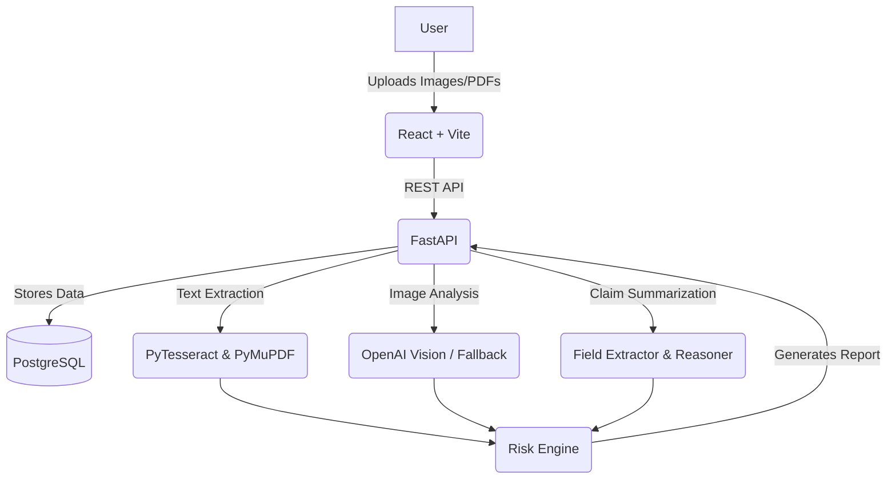

# ClaimVision AI — Multimodal Insurance Claim Analyzer

A production-style multimodal AI platform that analyzes vehicle insurance claims using uploaded vehicle damage images, repair invoices, accident descriptions, and claim documents. The system uses OCR, computer vision, document extraction, and LLM reasoning to generate a structured claim summary, damage classification, extracted fields, risk indicators, and a final report.

## 🚀 Key Features
- **Multimodal Claim Reasoning:** Combines text, tabular data (invoices), and images (damage) for holistic assessment.
- **Image Analysis (Computer Vision):** Identifies damage areas, severity, and impacted vehicle parts.
- **OCR & Document Intelligence:** Extracts structured fields from repair invoices and claim forms.
- **Risk Indicator Engine:** Cross-references claimed damage vs. invoice amounts to flag anomalies and generate a risk score.
- **RESTful API:** Built with FastAPI, backed by PostgreSQL.
- **Modern Dashboard:** React + TypeScript UI for uploading documents and viewing AI analysis results.

## 🏗 Architecture
The application uses a microservices-inspired monolithic architecture powered by Docker.



## 🧠 Multimodal AI Pipeline
1. **Document Extraction:** `PyMuPDF` reads digital PDFs. If no text is found (scanned), `PyTesseract` OCR takes over.
2. **Image Vision:** Vehicle damage images are preprocessed (resized/converted) and sent to Vision APIs to detect "Medium" or "High" severity damage.
3. **Reasoning & Risk Engine:** The engine evaluates if a "Low" severity damage image corresponds to an unusually high repair invoice amount (e.g., >$3000), flagging it as a potential risk factor.

## 🛠 Setup Instructions

### Environment Variables
Copy `.env.example` to `.env` in the `backend/` directory:
```bash
cp backend/.env.example backend/.env
```
_Note: If `OPENAI_API_KEY` is not provided, the system defaults to mock implementations by setting `USE_MOCK_VISION=true` and `USE_MOCK_OCR=true`._

### Running with Docker (Recommended)
Make sure you have Docker and Docker Compose installed.

```bash
docker-compose up --build
```

- **Frontend:** http://localhost:5173
- **Backend API Docs (Swagger):** http://localhost:8000/docs
- **Database:** Exposed on port 5432

## 🧪 API Examples
**Create a Claim:**
```bash
curl -X POST "http://localhost:8000/claims/" -H "Content-Type: application/json" -d '{"description": "Rear-ended", "vehicle_brand": "Toyota", "vehicle_model": "Camry"}'
```

**Run Analysis:**
```bash
curl -X POST "http://localhost:8000/claims/1/analyze"
```

## 🔒 Privacy & Security Note
- **Do not upload real personal insurance documents.** This platform is for demonstration purposes.
- Secrets (like API keys) must be managed securely via `.env` files and are never committed to version control.

## 🚀 Future Improvements
- Integration with Hugging Face models for local, offline inference.
- More granular risk scoring using historical claims data.
- Enhanced PDF layout analysis for complex, multi-page invoices.

## 📄 License
MIT License
